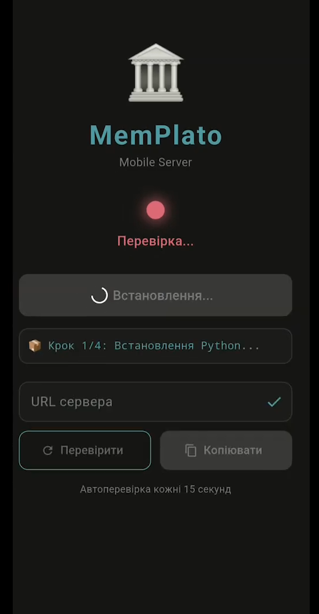
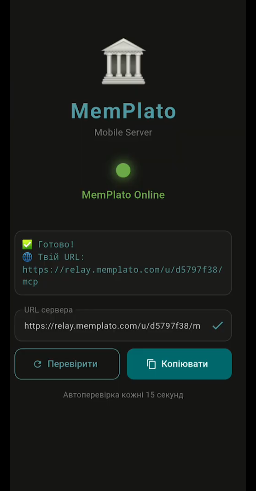
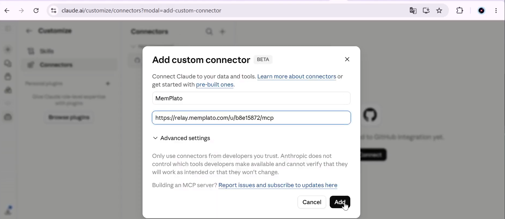
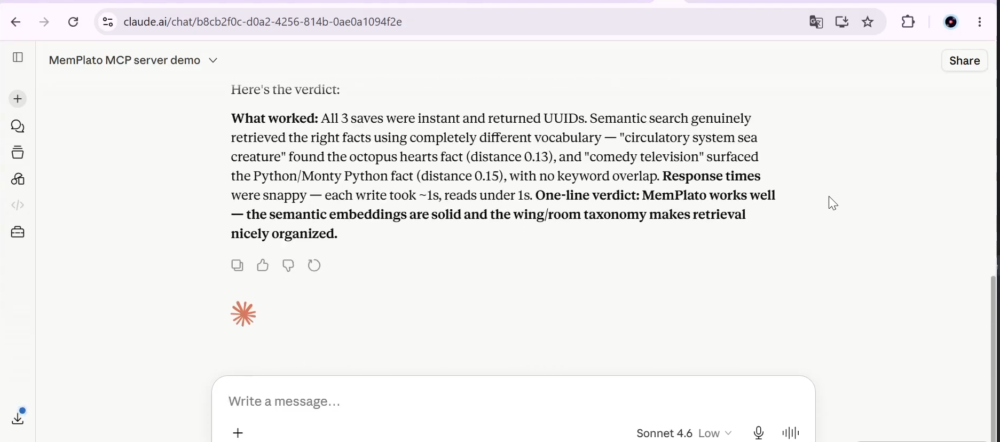

# 🏛️ MemPlato

**Personal MCP memory server that runs on your Android phone.**

Every AI conversation starts from zero. MemPlato fixes that — it's a persistent memory layer for AI assistants, running entirely on your own device. Your data never leaves your phone.

[](https://www.gnu.org/licenses/agpl-3.0)
[](https://github.com/VChe-creator/memplato/releases)
[](https://modelcontextprotocol.io)
[](https://github.com/VChe-creator/memplato/releases)

---

## What is MemPlato?

MemPlato turns your Android phone into a private MCP (Model Context Protocol) server. Claude, Perplexity, Cursor, and other AI tools can connect to it and remember things across conversations — your projects, preferences, notes, and context — without sending any of it to a cloud service.

**The phone stays in your pocket. The memory stays on your device.**

```text
Your Phone (Termux)          Relay Server              AI Assistant
─────────────────            ─────────────             ──────────────
memplato_server.py  ←──SSH──  relay.memplato.com  ←──MCP──  Claude
port 7333                     (just a bridge)
SQLite + ONNX                 your data never stored
```

---

## Screenshots

<p align="center">
  
  
  
  
</p>

---

## Installation Video

[](https://www.youtube.com/watch?v=GTd7QHjOtCk)

> 👆 Click to watch the full installation walkthrough on YouTube

---

## How it works

MemPlato runs a Python FastAPI server inside [Termux](https://github.com/termux/termux-app) on your Android phone. A reverse SSH tunnel through `relay.memplato.com` gives AI clients a stable HTTPS endpoint to connect to. The relay is a dumb pipe — it never stores your data.

**Tech stack:** Flutter (Android app) · Python 3.13 · FastAPI · SQLite · ONNX Runtime · MCP SSE · autossh

---

## Features

- **29 MCP tools** — drawers, knowledge graph, diary, tunnels, semantic search
- **Semantic search** with local ONNX embeddings (all-MiniLM-L6-v2, runs offline)
- **Knowledge graph** with temporal facts (valid_from / valid_to)
- **Cross-wing tunnels** — link related memory clusters
- **Agent diary** — per-agent journal entries
- **Your data stays on your phone** — 100% of your memories are stored locally on your device, never on external servers
- **Auto-reconnect watchdog** — tunnel restarts automatically if it drops
- **English + Ukrainian UI**

---

## Supported AI clients

| Client | Connection type | Status |
|--------|----------------|--------|
| Claude (claude.ai) | MCP SSE | ✅ Tested |
| Claude Desktop | MCP SSE | ✅ Tested |
| Perplexity | MCP SSE | ✅ Tested |
| Cursor | MCP SSE | ✅ Tested |
| Any MCP-compatible client | SSE or HTTP | Should work |

---

## Download

👉 **[Download latest APK (v1.0.5)](https://github.com/VChe-creator/memplato/releases/latest)**

The APK is ~280 MB because it includes Python, all libraries, and the AI model — so setup on your phone requires no internet connection.

---

## Setup guide

### What you need
- Android phone (Android 12+ recommended, ARM64)
- ~1 GB free storage
- Patience ☕

### Quick overview

1. Install [Termux from GitHub](https://github.com/termux/termux-app/releases/latest) *(not from Play Store — it's outdated)*
2. Install the [MemPlato APK](https://github.com/VChe-creator/memplato/releases/latest)
3. Grant permission in Android Settings
4. Follow the in-app setup steps — the app guides you through everything
5. Tap **Install and Start** — setup takes 30–90 minutes, keep screen on and charger plugged in
6. When done, a green dot appears and you get your personal URL:
```text
https://relay.memplato.com/u/YOUR_ID/mcp
```
7. In Claude → Settings → Connectors → Add MCP server → paste your URL

### Ongoing use

Termux must stay running in the background (you'll see it in your notification bar). The watchdog script automatically restarts the tunnel if it drops. You don't need to do anything — just keep Termux open.

> ⚠️ **Known limitation:** After rebooting your phone, the server does not restart automatically. Use the **Start** button in the app to restart it manually. Auto-start on boot will be added in a future update.

---

## MCP Tools reference

<details>
<summary>📦 Drawers (memory storage)</summary>

| Tool | Description |
|------|-------------|
| `memplato_add_drawer` | Save memory into a wing/room |
| `memplato_get_drawer` | Fetch a drawer by ID |
| `memplato_update_drawer` | Update content or move to new wing/room |
| `memplato_delete_drawer` | Delete a drawer |
| `memplato_list_drawers` | List drawers with optional filters |
| `memplato_search` | Semantic + keyword search |
| `memplato_check_duplicate` | Check if similar content already exists |
| `memplato_get_taxonomy` | Full wing → room → count overview |
</details>

<details>
<summary>🧠 Knowledge Graph</summary>

| Tool | Description |
|------|-------------|
| `memplato_kg_add` | Add a fact: subject → predicate → object |
| `memplato_kg_query` | Query relationships for an entity |
| `memplato_kg_invalidate` | Mark a fact as expired |
| `memplato_kg_timeline` | Chronological timeline of facts |
| `memplato_kg_stats` | Graph statistics |
</details>

<details>
<summary>🔗 Tunnels & Graph</summary>

| Tool | Description |
|------|-------------|
| `memplato_create_tunnel` | Link two memory locations |
| `memplato_list_tunnels` | List all tunnels |
| `memplato_follow_tunnels` | See what a room connects to |
| `memplato_traverse` | Walk the memory graph from a room |
| `memplato_find_tunnels` | Find rooms bridging two wings |
| `memplato_delete_tunnel` | Remove a tunnel |
| `memplato_graph_stats` | Graph overview |
</details>

<details>
<summary>📔 Diary & System</summary>

| Tool | Description |
|------|-------------|
| `memplato_diary_write` | Write to per-agent diary |
| `memplato_diary_read` | Read recent diary entries |
| `memplato_status` | Server status overview |
| `memplato_hook_settings` | Configure behavior flags |
| `memplato_reconnect` | Force DB reconnect |
| `memplato_memories_filed_away` | Check last checkpoint |
| `memplato_get_aaak_spec` | AAAK compressed memory format spec |
</details>

---

## Testing

MemPlato v1.0.5 was tested with **140+ test cases** covering all 29 tools including edge cases, stress tests, and failure scenarios.

**Results summary:**

| Category | Tests | Pass |
|----------|-------|------|
| Drawers (CRUD) | 20 | ✅ 18/20 |
| Semantic search | 9 | ✅ 7/9 |
| Knowledge Graph | 13 | ✅ 12/13 |
| Tunnels & Graph | 15 | ✅ 13/15 |
| Diary & System | 11 | ✅ 11/11 |
| Edge cases & stress | 72+ | ✅ Most pass |

**Known issues:**

The server is stable and handles all edge cases without crashing. There are known limitations that will be addressed in the next major version:

- **Embedding quality** — The lightweight ONNX model (all-MiniLM-L6-v2) optimized for mobile occasionally produces unexpected similarity scores for unrelated texts. Search works reliably for standard use cases. Will be improved in v2 with a better model.
- **Cross-lingual search** — Ukrainian/English mixed queries sometimes return suboptimal ranking. For best results, use the same language as your stored content.
- **Duplicate protection** — `add_drawer` does not automatically call `check_duplicate`. Best practice: call `check_duplicate` manually before saving.
- **Search limit** — Semantic search is optimized for queries returning up to 10 results. Requesting more may cause an error in some configurations.
- **Auto-start after reboot** — Auto-start after reboot — After rebooting your phone, use the Start button in the app to restart the server manually. Auto-start on boot will be added in a future update.

All known issues are cosmetic or edge-case. The core functionality — storing memories, knowledge graph, and MCP connectivity — works reliably.

---

## Architecture

```text
Android Phone
├── MemPlato.apk (Flutter)
│   ├── Manages setup flow
│   ├── Copies all files to Termux
│   └── Shows server status
│
└── Termux (Linux environment)
    ├── memplato_server.py (FastAPI + MCP)
    │   ├── /sse  ← MCP SSE endpoint
    │   ├── /mcp  ← MCP HTTP endpoint
    │   └── /health
    ├── palace.db (SQLite)
    ├── models/onnx/ (384-dim embeddings)
    ├── autossh (reverse tunnel)
    └── tunnel_watchdog.sh (auto-restart)

relay.memplato.com (Vultr VPS)
└── nginx + relay.py
    └── Bridges AI clients to your phone
    └── No data stored
```

---

## Why not Play Store?

MemPlato requires Termux, which needs sideloading due to Android restrictions on terminal apps. The Google Play version of Termux is outdated and incompatible. This is a known limitation of the current MVP architecture.

**The plan:** After funding, MemPlato v2 will run without Termux — the server will be embedded directly into the app. No terminal setup, no manual steps. Straight to Google Play.

---

## Roadmap

- [x] MVP — Flutter app + Python server + MCP SSE
- [x] All packages bundled in APK — no internet needed for setup
- [x] Reverse SSH tunnel via relay
- [x] 29 MCP tools
- [x] English + Ukrainian localization
- [ ] v2 — server embedded in app, no Termux needed
- [ ] v2 — sync across multiple phones, computers and clouds
- [ ] Google Play release
- [ ] Better embedding model
- [ ] Manual server start/stop from the app
- [ ] Auto-start on phone boot

---

## Support this project

MemPlato is built by a solo founder. If you find it useful, you can support the project:

- ⭐ **Star this repo** — it helps more than you think
- 🐛 **Report bugs** — open an [Issue](https://github.com/VChe-creator/memplato/issues)
- 💬 **Share feedback** — what features would you use?
- 💰 **Sponsor** — [GitHub Sponsors](https://github.com/sponsors/VChe-creator) *(coming soon)*

**Looking for pre-seed investment ($75K).** Building toward Google Play launch and 10,000 users. Reach out: [ceo@memplato.com](mailto:ceo@memplato.com) or [memplato.com](https://memplato.com)

---

## License

[AGPL-3.0](LICENSE) — free to use and modify, but derivative works must remain open source.

---

*Made with ☕ in Ukraine 🇺🇦*
